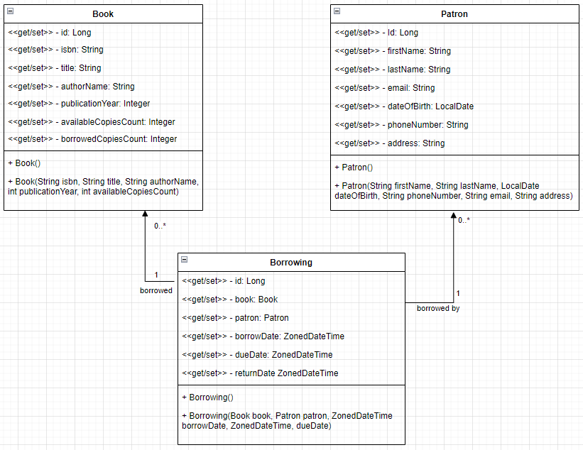

# Library Management API

## Objective
This project aims to act as a `RESTFUL API` for a `frontend` framework for a browser or mobile application. The project is about a library management system where I user can borrow a book for reading. The books are stored with their number of available copies. The borrowing is stored as a record where it saves when the book is borrowed and the due date. It also stores when the book is returned. The book also maintains the number of borrowed copies that haven't returned yet.

## UML of the stored data and their relations



## API Endpoints

### GET `/api/books`

Returns all stored books

```
HTTP/1.1 200 
Content-Type: application/json
Transfer-Encoding: chunked
Date: Mon, 12 Aug 2024 05:55:21 GMT
Connection: close

[
  {
    "id": 1,
    "isbn": "978-0735211292",
    "title": "Atomic Habits: An Easy & Proven Way to Build Good Habits & Break Bad Ones",
    "authorName": "James Clear",
    "publicationYear": 2018,
    "availableCopiesCount": 18,
    "borrowedCopiesCount": 0
  },
  {
    "id": 2,
    "isbn": "978-0385348638",
    "title": "Better Than Before: What I Learned About Making and Breaking Habits to Sleep More, Quit Sugar, Procrastinate Less, and Generally Build a Happier Life",
    "authorName": "Gretchen Rubin",
    "publicationYear": 2015,
    "availableCopiesCount": 10,
    "borrowedCopiesCount": 0
  }
]
```

### GET `/api/books/{id}`
#### `GET /api/books/1`
returns the books with the given `id`.

```
HTTP/1.1 200 
Content-Type: application/json
Transfer-Encoding: chunked
Date: Mon, 12 Aug 2024 05:58:24 GMT
Connection: close

{
  "id": 1,
  "isbn": "978-0735211292",
  "title": "Atomic Habits: An Easy & Proven Way to Build Good Habits & Break Bad Ones",
  "authorName": "James Clear",
  "publicationYear": 2018,
  "availableCopiesCount": 18,
  "borrowedCopiesCount": 0
}
```

#### `GET /api/books/3`
If the `id` doesn't exist, it returns `not found`.

```
HTTP/1.1 404 
Content-Type: text/plain;charset=UTF-8
Content-Length: 29
Date: Mon, 12 Aug 2024 06:00:16 GMT
Connection: close

No book with Id `3` is found.
```

### POST `/api/books`
Adds a new book
```
POST /api/books HTTP/1.1
Content-Type: application/json

{
  "isbn": "978-0735211292",
  "title": "Atomic Habits: An Easy & Proven Way to Build Good Habits & Break Bad Ones",
  "authorName": "James Clear",
  "publicationYear": 2018,
  "availableCopiesCount": 18
}
```
Response
```
HTTP/1.1 201 
Location: /api/books/1
Content-Type: application/json
Transfer-Encoding: chunked
Date: Mon, 12 Aug 2024 06:03:13 GMT
Connection: close

{
  "id": 1,
  "isbn": "978-0735211292",
  "title": "Atomic Habits: An Easy & Proven Way to Build Good Habits & Break Bad Ones",
  "authorName": "James Clear",
  "publicationYear": 2018,
  "availableCopiesCount": 18,
  "borrowedCopiesCount": 0
}
```

#### Note
Adding a new book requires all the properties shown above and `isbn` has to follow the standard and unique accross all added books and `publicationYear` has to be starting from `1000` and available copies count cannot be negative. These constraints holds as well for updating a book.

The `borrowedCopiesCount` property is a view only property; it can't be inserted nor updated from the endpoint.

### PUT `/api/books/{id}`
```
PUT /api/books/1 HTTP/1.1
Content-Type: application/json

{
  "isbn": "978-0735211292",
  "title": "Atomic Habits",
  "authorName": "James Clear",
  "publicationYear": 2018,
  "availableCopiesCount": 20
}
```
Response
```
HTTP/1.1 200 
Content-Type: application/json
Transfer-Encoding: chunked
Date: Mon, 12 Aug 2024 06:12:13 GMT
Connection: close

{
  "id": 1,
  "isbn": "978-0735211292",
  "title": "Atomic Habits",
  "authorName": "James Clear",
  "publicationYear": 2018,
  "availableCopiesCount": 20,
  "borrowedCopiesCount": 0
}
```
If No book exisits with the specified `id` a bad request is returned.
```
PUT /api/books/5 HTTP/1.1
Content-Type: application/json

{
    "isbn": "978-0385348638",
    "title": "Better Than Before: What I Learned About Making and Breaking Habits to Sleep More, Quit Sugar, Procrastinate Less, and Generally Build a Happier Life",
    "authorName": "Gretchen Rubin",
    "publicationYear": 2015,
    "availableCopiesCount": 10
}
```
Response
```
HTTP/1.1 400 
Content-Type: text/plain;charset=UTF-8
Content-Length: 27
Date: Mon, 12 Aug 2024 06:17:20 GMT
Connection: close

No book with Id 5 is found.
```

#### Note
the previously laid out constraints in adding also holds when updating.

### DELETE `/api/books/{id}`
```
DELETE /api/books/1 HTTP/1.1
```
Response
```
HTTP/1.1 200 
Content-Length: 0
Date: Mon, 12 Aug 2024 06:19:39 GMT
Connection: close


```
If no book with the specified `id` exists, results in `not found`.
```
DELETE /api/books/5 HTTP/1.1
```
Response
```
HTTP/1.1 404 
Content-Length: 0
Date: Mon, 12 Aug 2024 06:22:20 GMT
Connection: close

```

### POST `/api/patrons`
Adds a new patron. When requesting, the patron must have all the following properties in the request specified or a bad request is returned. `firstName` and `lastName` also has to follow the format that the first letter is uppercase and the rest are lowercase. Spaces or white characters are neither allowed in `firstName` nor `lastName`. The email has to be in a valid format. Phone number has to be `11` digits starting with either `010`, `011`, `012`, `015`.
```
POST /api/patrons HTTP/1.1
Content-Type: application/json

{
    "firstName": "Personfirstname",
    "lastName": "Personlastname",
    "dateOfBirth": "1999-09-20",
    "phoneNumber": "01223456789",
    "email": "personfirstname.personlastname@domain.com",
    "address": "some place city country"
}
```
Response
```
HTTP/1.1 201 
Location: /api/patrons/1
Content-Type: application/json
Transfer-Encoding: chunked
Date: Mon, 12 Aug 2024 10:51:55 GMT
Connection: close

{
  "id": 1,
  "firstName": "Personfirstname",
  "lastName": "Personlastname",
  "email": "personfirstname.personlastname@domain.com",
  "dateOfBirth": "1999-09-20",
  "phoneNumber": "01223456789",
  "address": "some place city country"
}
```
### GET `/api/patrons`
Returns all patrons.
```
HTTP/1.1 200 
Content-Type: application/json
Transfer-Encoding: chunked
Date: Mon, 12 Aug 2024 11:04:45 GMT
Connection: close

[
  {
    "id": 1,
    "firstName": "Personfirstname",
    "lastName": "Personlastname",
    "email": "personfirstname.personlastname@domain.com",
    "dateOfBirth": "1999-09-20",
    "phoneNumber": "01223456789",
    "address": "some place city country"
  }
]
```
### GET `/api/patrons/{id}`
Returns a patron with the specified `id`. If no patron with the specified `id` exists, a `not found` response is returned.
#### Valid request
```
GET /api/patrons/1 HTTP/1.1
```
Response
```
HTTP/1.1 200 
Content-Type: application/json
Transfer-Encoding: chunked
Date: Mon, 12 Aug 2024 11:01:05 GMT
Connection: close

{
  "id": 1,
  "firstName": "Personfirstname",
  "lastName": "Personlastname",
  "email": "personfirstname.personlastname@domain.com",
  "dateOfBirth": "1999-09-20",
  "phoneNumber": "01223456789",
  "address": "some place city country"
}
```
#### Invalid request
```
GET /api/patrons/5 HTTP/1.1
```
Response
```
HTTP/1.1 404 
Content-Type: text/plain;charset=UTF-8
Content-Length: 31
Date: Mon, 12 Aug 2024 11:01:59 GMT
Connection: close

No patron with Is `5` is found.
```
### PUT `/api/patrons/{id}`
Updates a patron with `id`. If No patron with `id` exists, a `not found` response is returned.
#### Valid request
```
PUT /api/patrons/1 HTTP/1.1
Content-Type: application/json

{
    "firstName": "Pfn",
    "lastName": "Pln",
    "dateOfBirth": "1999-09-20",
    "phoneNumber": "01223456789",
    "email": "personfirstname.personlastname@domain.com",
    "address": "some place city country"
}
```
Response
```
HTTP/1.1 200 
Content-Type: application/json
Transfer-Encoding: chunked
Date: Mon, 12 Aug 2024 11:06:46 GMT
Connection: close

{
  "id": 1,
  "firstName": "Pfn",
  "lastName": "Pln",
  "email": "personfirstname.personlastname@domain.com",
  "dateOfBirth": "1999-09-20",
  "phoneNumber": "01223456789",
  "address": "some place city country"
}
```
#### Invalid request
```
PUT /api/patrons/7 HTTP/1.1
Content-Type: application/json

{
    "firstName": "Pfn",
    "lastName": "Pln",
    "dateOfBirth": "1999-09-20",
    "phoneNumber": "01223456789",
    "email": "personfirstname.personlastname@domain.com",
    "address": "some place city country"
}
```
Response
```
HTTP/1.1 404 
Content-Type: text/plain;charset=UTF-8
Content-Length: 31
Date: Mon, 12 Aug 2024 11:10:14 GMT
Connection: close

No patron with Is `7` is found.
```

### DELETE `/api/patrons/{id}`
Deletes a patron with `id`. If no patron with `id` exists, a `not found` is returned.
#### Valid request
```
DELETE /api/patrons/1 HTTP/1.1
```
Response
```
HTTP/1.1 200 
Content-Length: 0
Date: Mon, 12 Aug 2024 11:13:13 GMT
Connection: close


```
#### Invalid request
```
DELETE /api/patrons/27 HTTP/1.1
```
Response
```
HTTP/1.1 404 
Content-Length: 0
Date: Mon, 12 Aug 2024 11:14:39 GMT
Connection: close


```
### POST `/api/borrow/{bookId}/patron/{patronId}`
Lends patron with `patronId` book with `bookId`. It decrements `availableCopiesCount` in the lended book, and increments `borrowedCopiesCount`. It assigns `borrowedDate` to the current timestamp, `dueDate` to `2` weeks from now, and `returnDate` to `null`.

#### Valid borrow
```
POST /api/borrow/1/patron/1 HTTP/1.1
```
Response
```
HTTP/1.1 200 
Content-Type: application/json
Transfer-Encoding: chunked
Date: Mon, 12 Aug 2024 12:13:24 GMT
Connection: close

{
  "id": 1,
  "book": {
    "id": 1,
    "isbn": "978-0735211292",
    "title": "Atomic Habits: An Easy & Proven Way to Build Good Habits & Break Bad Ones",
    "authorName": "James Clear",
    "publicationYear": 2018,
    "availableCopiesCount": 0,
    "borrowedCopiesCount": 1
  },
  "patron": {
    "id": 1,
    "firstName": "Personfirstname",
    "lastName": "Personlastname",
    "email": "personfirstname.personlastname@domain.com",
    "dateOfBirth": "1999-09-20",
    "phoneNumber": "01223456789",
    "address": "some place city country"
  },
  "borrowDate": "2024-08-12T15:13:24.0498536+03:00",
  "dueDate": "2024-08-26T15:13:24.0498536+03:00",
  "returnDate": null
}
```
#### Invalid request: can't lend book to a patron who already borrowed the book and hasn't returned it, yet.
```
POST /api/borrow/2/patron/1 HTTP/1.1
```
Response
```
HTTP/1.1 400 
Content-Type: text/plain;charset=UTF-8
Content-Length: 65
Date: Mon, 12 Aug 2024 12:16:26 GMT
Connection: close

The books is already borrowed and not returned yet by the patron.
```
#### Invalid request can't lend book to a patron and the book has no available copies.
```
POST /api/borrow/1/patron/2 HTTP/1.1
```
Response
```
HTTP/1.1 404 
Content-Type: text/plain;charset=UTF-8
Content-Length: 25
Date: Mon, 12 Aug 2024 12:18:50 GMT
Connection: close

No available book copies.
```
#### Invalid request: can't lend book to nonexistent patron.
```
POST /api/borrow/2/patron/71 HTTP/1.1
```
Response
```
HTTP/1.1 400 
Content-Type: text/plain;charset=UTF-8
Content-Length: 21
Date: Mon, 12 Aug 2024 12:21:07 GMT
Connection: close

No patron with Id 71.
```
#### Invalid request: can't lend nonexistent book to a patron.
```
POST /api/borrow/21/patron/1 HTTP/1.1
```
Response
```
HTTP/1.1 400 
Content-Type: text/plain;charset=UTF-8
Content-Length: 19
Date: Mon, 12 Aug 2024 12:22:12 GMT
Connection: close

No book with Id 21.
```
### PUT `/api/return/{bookId}/patron/{patronId}`
Accepts return of a borrowed book with `bookId` by a patron with `patronId`. It decrements `borrowedCopiesCount` and increments `availableCopiesCount` in the book with `bookId`. It also assigns `returnDate` to the current timestamp.
#### Valid request
```
PUT /api/return/1/patron/1 HTTP/1.1
```
Response
```
HTTP/1.1 200 
Content-Type: application/json
Transfer-Encoding: chunked
Date: Mon, 12 Aug 2024 12:29:47 GMT
Connection: close

{
  "id": 1,
  "book": {
    "id": 1,
    "isbn": "978-0735211292",
    "title": "Atomic Habits: An Easy & Proven Way to Build Good Habits & Break Bad Ones",
    "authorName": "James Clear",
    "publicationYear": 2018,
    "availableCopiesCount": 1,
    "borrowedCopiesCount": 0
  },
  "patron": {
    "id": 1,
    "firstName": "Personfirstname",
    "lastName": "Personlastname",
    "email": "personfirstname.personlastname@domain.com",
    "dateOfBirth": "1999-09-20",
    "phoneNumber": "01223456789",
    "address": "some place city country"
  },
  "borrowDate": "2024-08-12T12:13:24.049854Z",
  "dueDate": "2024-08-26T12:13:24.049854Z",
  "returnDate": "2024-08-12T15:29:47.9213077+03:00"
}

```
#### Invalid request: The book isn't currently borrowed by the patron.
```
PUT /api/return/1/patron/1 HTTP/1.1
```
Response
```
HTTP/1.1 404 
Content-Type: text/plain;charset=UTF-8
Content-Length: 58
Date: Mon, 12 Aug 2024 12:31:15 GMT
Connection: close

No active borrowing of book with Id 1 by patron with Id 1.
```